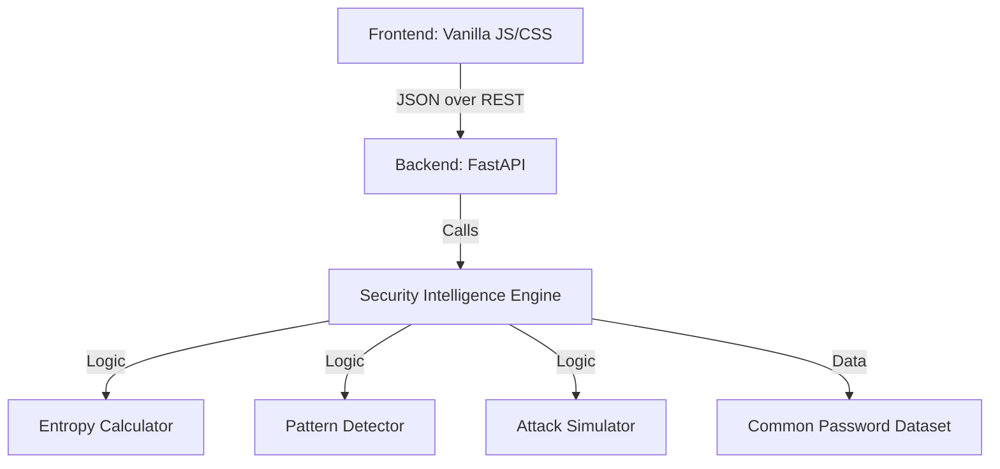

# Architecture Overview: PSIP

## 1. System Design
The **Password Strength Intelligence Platform (PSIP)** is built on a decoupled **Client-Server Architecture**.

### Component Diagram

## 2. Technology Stack Rationale
- **FastAPI**: Chosen for its high performance (Starlette based) and automatic OpenAPI documentation. Ideal for rapid, secure API development.
- **Python**: The industry standard for security logic and data analysis.
- **Vanilla CSS/JS**: Ensures zero dependencies, maximum performance, and demonstrates core engineering proficiency without framework overhead.

## 3. Security Engine Layers
1. **Shannon Entropy**: Measures information density. We define 80 bits as the threshold for "Strong" based on modern GPU cracking capabilities.
2. **Keyboard Adjacency**: Checks for predictable physical patterns (e.g., `qwerty`, `asdf`).
3. **Dictionary Matching**: Cross-references against the `common_passwords.txt` dataset (simulating a breach lookup).
4. **Mutation Intelligence**: Identifies "leetspeak" substitutions (`a` -> `@`) which are easily reversible by attackers.

## 4. Privacy & Zero-Trust Principles
- **In-Memory Only**: No passwords are ever stored in a database.
- **No Logs**: The backend is configured to not log the request body containing the password.
- **Client-Side Sanitization**: Minimal, but we encourage "blind" analysis where possible.
- **Transience**: The analysis exists only for the duration of the HTTP session.
